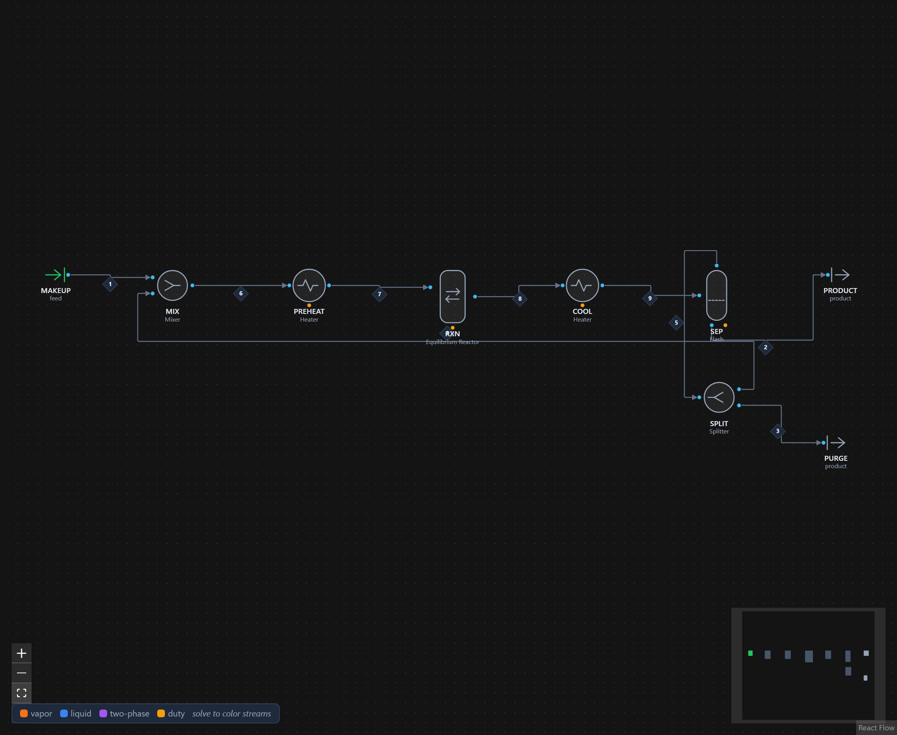
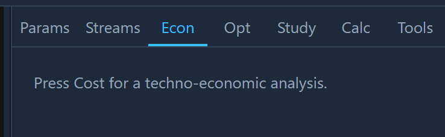

# Your first flowsheet: ammonia synthesis loop with recycle and costing

**Goal.** Build a Haber-Bosch ammonia synthesis loop — reactor, chiller,
flash separator, recycle and purge — solve the recycle to convergence, read the
stream table, then size and cost every unit and get the levelized cost of
ammonia. You will do it twice: once by clicking in the web app, once as a ~40-line
Python script.

If you have driven HYSYS or Aspen Plus, everything here will be familiar — a
recycle with a tear stream, an equilibrium reactor, a flash. What is new is that
the *costing* is in the same tool and the *flowsheet is a diffable text file*.

**Time:** ~15 minutes. **You need:** Caldyr installed
([Getting started](getting-started.md)); the web app running if you want the UI
path.

---

## The process

```
MAKEUP ─▶ MIX ─▶ PREHEAT ─▶ REACTOR ─▶ COOL ─▶ SEP ─┬─▶ PRODUCT (liquid NH₃)
           ▲                                          │
           │                                   (vapor)│
           └──────────── RECYCLE ◀── SPLIT ◀──────────┘
                                       │
                                       ▼
                                    PURGE (bleeds inert argon)
```

N₂ + 3H₂ ⇌ 2NH₃ is exothermic and mole-reducing, so single-pass conversion is
low — the reactor runs near equilibrium at 200 bar and 400 °C and still only
reaches ~31 mol% NH₃. Unreacted synthesis gas is chilled, the ammonia condenses
out as a liquid product, and the vapor is recycled. A 1% argon inert rides in
with the makeup and would accumulate to a loop-choking level without a bleed, so
the splitter purges 10% of the recycle vapor. That recycle is a **closed loop**,
so the solver must *tear* it: guess the recycle stream, solve around the loop,
and iterate until the guess matches the result.


*The solved loop in the web app's PFD view, streams colored by phase (legend
bottom-left). The recycle runs back along the bottom from the splitter to the
mixer; the purge and liquid-ammonia product leave at the right.*

---

## Path A — build it in the web app

1. **Start the app** (`python -m uvicorn api.main:app --port 8753` and, in
   another terminal, `cd web && npm run dev`), then open
   <http://localhost:5273>.
2. **Load the template.** Open **Projects → Templates → Ammonia loop**. The
   canvas fills with six units (Mixer, Heater ×2, EquilibriumReactor, Flash,
   Splitter), the four components (nitrogen, hydrogen, ammonia, argon), the
   Peng-Robinson package, and the makeup feed already specified. This is the
   exact flowsheet the Python script below builds.
3. **Inspect before solving.** Click the **RXN** reactor: the Params tab shows
   the stoichiometry `N₂ + 3H₂ → 2NH₃` (key component nitrogen) and the reactor
   temperature 673.15 K. Click the **MAKEUP** feed to see its state: 100 mol/s at
   300 K, 200 bar, 3:1 H₂:N₂ with 1% argon.
4. **Solve.** Press **Solve**. Watch the status bar — it reports the tear
   stream (`RECYCLE`) and live residual as Wegstein acceleration drives the loop
   closed. It converges in well under a second.
5. **Read the results.** The **Streams** tab shows the stream table, the
   convergence plot (residual vs iteration), and the mass & energy **balance
   check** — every element closes.
6. **Cost it.** In the flowsheet panel confirm the **costing product** is
   `ammonia`, then open the **Econ** tab. It sizes and costs every unit, rolls
   up capital and operating cost, and shows the LCOP, an interactive tornado, and
   (press **Monte-Carlo**) a P10/P50/P90 histogram.


*The Econ tab after pressing Cost: KPI cards (LCOP $0.690/kg, TCI, OPEX, NPV), the
installed-equipment table, and the LCOP sensitivity tornado — feed price is the
longest bar by far.*

> The Copilot panel can do all of this from a sentence ("build and cost an
> ammonia loop") and hand you back the same flowsheet as a reviewable diff — but
> the point of this tutorial is to know what it is doing.

---

## Path B — build it in Python

The same flowsheet as a script. This is `examples/04_ammonia_loop.py` plus the
costing from `examples/05_ammonia_economics.py`, which you can run directly:

```bash
python examples/04_ammonia_loop.py      # the loop
python examples/05_ammonia_economics.py # the loop + costing
```

### Components and property package

```python
from caldyr.core import Component, Flowsheet
from caldyr.unitops import (
    EquilibriumReactor, FlashDrum, Heater, Mixer, Splitter,
)

AMMONIA = {"stoich": {"nitrogen": -1, "hydrogen": -3, "ammonia": 2},
           "key": "nitrogen"}
P_LOOP = 2.0e7   # 200 bar
T_RXN  = 673.15  # 400 °C

fs = Flowsheet(
    components=[Component(c) for c in ("nitrogen", "hydrogen", "ammonia", "argon")],
    property_package="thermo:PR",
)
```

**Why Peng-Robinson (`thermo:PR`)?** The loop is a light, permanent-gas mixture
(N₂, H₂, Ar, NH₃) at 200 bar and up to 400 °C — well above the critical points of
the gases. This is the regime cubic equations of state were built for: PR gives
good high-pressure vapor densities and a physically correct
vapor-liquid split when the gas is chilled to condense ammonia. An
activity-coefficient model (NRTL, UNIQUAC) would be the *wrong* choice here —
those describe non-ideal *liquid* mixtures at low pressure and have no
high-pressure gas-phase story. Same rule of thumb you would apply in HYSYS:
gas-processing and high-pressure hydrocarbons → PR; polar low-pressure liquids →
an activity model.

### Units and connections

```python
fs.add(Mixer("MIX", {"dP": 0.0}))
fs.add(Heater("PREHEAT", {"T_out": T_RXN}))
fs.add(EquilibriumReactor("RXN", {"reaction": AMMONIA, "T": T_RXN}))
fs.add(Heater("COOL", {"T_out": 250.0}))          # chill to condense NH₃
fs.add(FlashDrum("SEP", {"T": 250.0, "P": P_LOOP}))
fs.add(Splitter("SPLIT", {"split": 0.90}))         # purge 10% of the vapor

fs.feed("MAKEUP", "MIX:in1", T=300.0, P=P_LOOP, molar_flow=100.0,
        z={"nitrogen": 0.2475, "hydrogen": 0.7425, "ammonia": 0.0, "argon": 0.01})
fs.connect("S1", "MIX:out", "PREHEAT:in1")
fs.connect("S2", "PREHEAT:out", "RXN:in1")
fs.connect("S3", "RXN:out", "COOL:in1")
fs.connect("S4", "COOL:out", "SEP:in1")
fs.connect("PRODUCT", "SEP:liquid", None)          # None = product boundary
fs.connect("VAP", "SEP:vapor", "SPLIT:in1")
fs.connect("RECYCLE", "SPLIT:out1", "MIX:in2")     # closes the loop
fs.connect("PURGE", "SPLIT:out2", None)
for unit in ("PREHEAT", "RXN", "COOL", "SEP"):
    fs.connect(f"Q_{unit}", f"{unit}:duty", None)  # energy streams to boundary
```

A few things worth noting, because they differ from a GUI simulator:

- **Ports are named.** A `FlashDrum` exposes `in1`, `vapor`, `liquid`, `duty`;
  a `Splitter` exposes `in1`, `out1`, `out2`. Connecting `SPLIT:out1` back to
  `MIX:in2` is what makes the recycle a recycle — the engine detects the cycle
  automatically, you do not place a "RECYCLE" block.
- **`None` is a boundary.** `fs.connect("PRODUCT", "SEP:liquid", None)` sends the
  liquid to a product boundary (a HYSYS product stream). Energy ports (`:duty`)
  go to boundaries too, so the balance can account for them.
- **The Splitter `split=0.90`** sends 90% of the vapor to `out1` (recycle) and
  10% to `out2` (purge).

### Solve

```python
report = fs.solve(tol=1e-7, max_iter=400)
print(f"Torn stream(s): {report.tear_streams}   method: {report.method}")
print(f"Converged: {report.converged} in {report.iterations} iterations "
      f"(residual {report.residual:.1e})")
```

```
Torn stream(s): ['RECYCLE']   method: wegstein
Converged: True in 38 iterations (residual 8.8e-08)
```

**What just happened.** The solver found one cycle and chose `RECYCLE` as the
**tear stream**. It seeded a guess for that stream, solved MIX → PREHEAT → RXN →
COOL → SEP → SPLIT in order, compared the new `RECYCLE` against the guess, and
repeated. Plain successive substitution on a tight ammonia loop converges slowly
(the recycle is ~0.9× the makeup), so Caldyr accelerates it with **Wegstein**
extrapolation — it fits the fixed-point iteration and jumps ahead. 38 iterations
to a 10⁻⁷ residual is the result; that residual is the max relative change in the
torn stream between passes. This is the sequential-modular solver; the ammonia
loop also solves with `backend="equation_oriented"` (all equations at once, no
tear) — see [the optimization tutorial](tutorial-optimization.md).

### Read the stream table

```python
for sid in ("MAKEUP", "S2", "S3", "PRODUCT", "RECYCLE", "PURGE"):
    s = fs.streams[sid]
    print(sid, round(s.T, 1), round(s.molar_flow, 3), s.z)
```

| stream | T/K | n/(mol/s) | N₂ | H₂ | NH₃ | Ar |
|---|--:|--:|--:|--:|--:|--:|
| MAKEUP | 300.0 | 100.000 | 0.247 | 0.743 | 0.000 | 0.010 |
| S2 (reactor in) | 673.1 | 193.855 | 0.234 | 0.715 | 0.012 | 0.039 |
| S3 (reactor out) | 673.1 | 149.344 | 0.155 | 0.481 | **0.314** | 0.051 |
| PRODUCT | 250.0 | 45.061 | 0.005 | 0.008 | **0.982** | 0.006 |
| RECYCLE | 250.0 | 93.855 | 0.219 | 0.685 | 0.025 | 0.070 |
| PURGE | 250.0 | 10.428 | 0.219 | 0.685 | 0.025 | 0.070 |

How to read it:

- **Per-pass conversion is low.** The reactor outlet (S3) is only 31.4 mol% NH₃
  — that is equilibrium at these conditions. The loop exists precisely because
  one pass is not enough.
- **The recycle is real.** The reactor *feed* (S2, 194 mol/s) is nearly double
  the makeup (100 mol/s): most of what enters the reactor is recycled gas. The
  recycle ratio here is 0.94.
- **The separator does the work.** Chilling to 250 K condenses a 98.2%-pure
  liquid ammonia product (45.1 mol/s, ~44.25 mol/s of it NH₃) while the N₂/H₂
  stay vapor and recycle.
- **Argon accumulates until the purge balances it.** RECYCLE and PURGE have
  identical composition (they are two arms of one splitter) and argon has climbed
  to 7 mol% — the loop concentrates the inert until the purge removes it as fast
  as the makeup brings it in. That is the purge's whole job.

The example also verifies that N, H and Ar atom balances close around the entire
loop (in = out to machine precision) — the first thing to check on any recycle.

---

## Costing: from a solved flowsheet to $/kg

Now hand the solved flowsheet to the techno-economic pipeline. This is
`examples/05_ammonia_economics.py`:

```python
from caldyr.economics import TEAConfig, analyze, tornado, monte_carlo

res = analyze(fs, report, TEAConfig())   # product defaults to "ammonia"
```

`analyze` runs the whole chain: **size** each unit from its solved duty/flow/
volume → **purchased cost** from Turton correlations → **bare-module cost**
(installation, piping, instrumentation) → **capital** roll-up → **operating
cost** → **profitability**. One call, and `res` carries every intermediate.

### Capital

```python
for size, cost in zip(res.sizes, res.costs):
    print(size.unit_id, size.equipment_type, round(size.attribute, 2),
          round(cost.bare_module))
```

| unit | equipment type | size | installed C_bm |
|---|---|--:|--:|
| PREHEAT | heat_exchanger | 64.23 m² | $168,891 |
| RXN | vessel_vertical | 0.86 m³ | $185,412 |
| COOL | heat_exchanger | 39.33 m² | $149,182 |
| SEP | vessel_vertical | 3.77 m³ | $615,035 |

```
ISBL (installed) ........ $1,118,520
OSBL (offsites) ......... $164,716
grassroots (fixed cap) .. $1,484,570
working capital ......... $222,685
total capital (TCI) ..... $1,707,255
```

**ISBL** (inside battery limits) is the sum of installed equipment. **OSBL**
adds offsite/utility infrastructure as a factor of ISBL; contingency and fees
bring it to the **grassroots** fixed capital; add working capital → **TCI**,
$1.7 M. These are Turton bare-module numbers escalated to 2023 with CEPCI (change
`TEAConfig(year=...)` to re-escalate). Note the flash separator (SEP) dominates
capital — it is a thick-walled 200-bar vessel.

### Operating cost

```
Operating cost ($/yr, 8000 h/yr):
  raw materials ........... $8,463,360
  utilities ............... $1,581,607
  fixed (labor/maint/OH) .. $4,719,700
  total (COM) ............. $14,764,666
```

**Raw materials dominate**, and that is the whole story of this flowsheet. The
makeup gas — priced here with merchant hydrogen at $1.50/kg — costs $8.5 M/yr,
far more than utilities or fixed cost. That is deliberate: it is the *green
ammonia* thesis in one number. If your hydrogen is expensive, the ammonia plant's
economics are set at the feed, not the hardware.

### Levelized cost and profitability

```python
pr = res.profitability
print(f"LCOP  = ${pr.lcop:.3f}/kg NH₃  (= ${pr.lcop*1000:.0f}/t)")
print(f"NPV   = ${pr.npv:,.0f}   IRR = {pr.irr}")
```

```
NH₃ production .......... 21.7 kt/yr
revenue (@ $0.50/kg) .... $10,851,329/yr
LCOP .................... $0.690/kg NH₃  (= $690/t)
NPV ..................... $-35,023,696   IRR: n/a (cost > price)   payback: n/a
```

**LCOP** — levelized cost of product — is the headline:
`LCOP = (annualized TCI + annual OPEX) / annual production`. At **$0.690/kg**
this toy loop cannot compete with a $0.50/kg sale price, so the NPV is negative
and there is no IRR. That is an honest result, not a bug: with merchant-priced
hydrogen the feed alone ($8.5 M/yr) nearly matches the revenue ($10.9 M/yr). The
lesson chemical engineers already know — for a synthesis loop, *feedstock price
is destiny* — falls straight out of the numbers.

### Which assumptions actually matter — tornado and Monte-Carlo

```python
for b in tornado(fs, res.sizes, res.config):
    print(b.variable, round(b.swing, 3), b.low_lcop, "->", b.high_lcop)
```

```
LCOP sensitivity (tornado):
  feed price ±15%   $0.618 -> $0.762   (swing $0.144)
  capacity factor   $0.699 -> $0.681   (swing $0.017)
  capex ±30%        $0.683 -> $0.696   (swing $0.013)
  discount rate     $0.688 -> $0.692   (swing $0.004)
```

The tornado ranks each assumption by how far it moves LCOP when swung over a
plausible range. **Feed price dwarfs everything** — a ±15% move in feed price
swings LCOP ten times as far as a ±30% move in *capex*. For this plant, arguing
about equipment cost estimates is wasted effort; the feed contract is the deal.

```python
mc = monte_carlo(fs, res.sizes, res.config, n=3000, seed=1)
print(mc.lcop)  # {'p10': ..., 'p50': ..., 'p90': ...}
```

```
Monte-Carlo LCOP ($/kg, n=3000):  P10 $0.601  P50 $0.691  P90 $0.781
```

Monte-Carlo samples cost-correlation error and prices together and reports the
distribution, not a point. The P10–P90 band ($0.60–$0.78/kg) is the honest
uncertainty on that $0.69 median — every one of those draws is above the $0.50
sale price.

---

## Try this: watch the purge fraction move the loop

The purge is the loop's release valve. Tighten it and inerts pile up; open it and
you throw away synthesis gas. Sweep the splitter's `split` (fraction *recycled*,
so `1 − split` is purged) and watch the argon in the loop:

```python
for split in (0.80, 0.90, 0.93, 0.95, 0.97):
    fs = build()                       # rebuild fresh each time
    fs.units["SPLIT"].params["split"] = split
    rep = fs.solve(tol=1e-7, max_iter=600)
    rec = fs.streams["RECYCLE"]
    prod = fs.streams["PRODUCT"]
    print(f"purge {1-split:4.0%}  Ar_recycle {rec.z['argon']:.3f}  "
          f"recycle {rec.molar_flow:6.1f} mol/s  "
          f"NH₃ product {prod.molar_flow*prod.z['ammonia']:.2f} mol/s")
```

You will see the trade-off directly. As you shrink the purge from 20% to 3%:

| purge | argon in recycle | recycle flow | NH₃ product |
|--:|--:|--:|--:|
| 20% | 0.046 | 72.8 mol/s | 40.34 mol/s |
| 10% | 0.070 | 93.9 mol/s | 44.25 mol/s |
| 7% | 0.086 | 102.9 mol/s | 45.58 mol/s |
| 5% | 0.102 | 110.7 mol/s | 46.53 mol/s |
| 3% | 0.127 | 121.5 mol/s | 47.53 mol/s |

Tightening the purge recovers more product (you vent less synthesis gas, so more
of it eventually converts) — but at a real cost: argon in the loop climbs from
5% to 13%, the recycle grows by two thirds, and every unit downstream of the mixer
now processes far more gas (raise `max_iter`, since the diluting inert slows
convergence). Bigger recycle means bigger, more expensive equipment and more
compression and refrigeration duty. So there is a genuine optimum — more purge
throws away feed, less purge inflates capital and utilities — and finding it
against an economic objective is exactly what [the optimization
tutorial](tutorial-optimization.md) does.

---

## What you learned

- A recycle is closed by connecting an outlet back to an upstream inlet; the
  engine finds the cycle, tears it, and converges it with Wegstein — no manual
  RECYCLE block.
- Peng-Robinson is the right package for a high-pressure permanent-gas loop, for
  the same reasons you would pick it in HYSYS.
- `analyze(fs, report, TEAConfig(...))` turns a solved flowsheet into sizing,
  capital, opex, LCOP, tornado and Monte-Carlo in one call.
- LCOP plus a tornado tells you not just the cost but *which assumption to argue
  about* — here, the feed price.

**Next:** [Design and cost a distillation column](tutorial-distillation-tea.md)
takes a separation from shortcut design through a rigorous MESH check to a
reflux-ratio cost trade-off.
