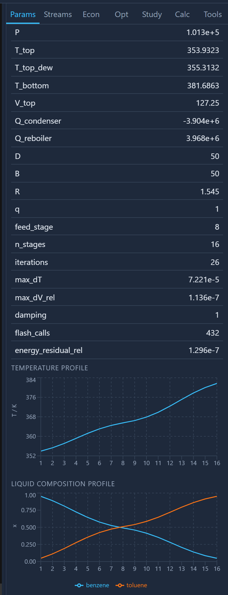
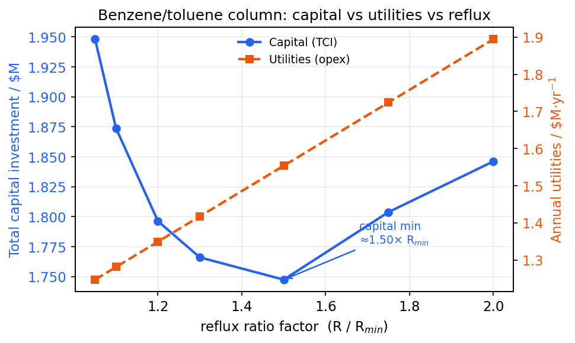

# Design and cost a distillation column

**Goal.** Take a benzene/toluene separation from a **shortcut (FUG) design** — the
back-of-envelope column you would size by hand or in a HYSYS Shortcut column —
through a **rigorous tray-by-tray (MESH) rating** that confirms it, then **size
and cost** the tower and finally sweep the **reflux ratio** to see the classic
capital-vs-utility trade-off in dollars.

This is the tutorial that shows Caldyr doing the everyday work of a process
simulator: design a real column, verify it against rigorous stage-by-stage
balances, and put a number on it — the loop you run dozens of times in a
separations study.

**Time:** ~20 minutes. **You need:** Caldyr installed
([Getting started](getting-started.md)). Everything here is drawn from
`examples/08_distillation.py` (shortcut + costing) and
`examples/11_rigorous_column.py` (shortcut → rigorous, side by side):

```bash
python examples/08_distillation.py
python examples/11_rigorous_column.py
```

---

## The problem

An equimolar benzene/toluene feed, 100 mol/s, saturated liquid at 1 atm and
365 K. We want 99% of the benzene overhead and 98% of the toluene in the bottoms
— a routine, clean, close-to-ideal split (α ≈ 2.4), the textbook first column.

---

## Step 1 — shortcut design (Fenske-Underwood-Gilliland)

The `ShortcutColumn` runs the classic FUG procedure: **Fenske** for minimum
stages, **Underwood** for minimum reflux, **Gilliland** for the actual stage
count at an operating reflux, and **Kirkbride** for the feed-stage location. You
give it the keys, the recoveries, a reflux multiple, and the pressure — nothing
about stages, because computing them is the column's job.

```python
from caldyr.core import Component, Flowsheet
from caldyr.unitops import ShortcutColumn

P_ATM = 101325.0
fs = Flowsheet(components=[Component("benzene"), Component("toluene")],
               property_package="thermo:PR")
fs.add(ShortcutColumn("COL", {
    "light_key": "benzene", "heavy_key": "toluene",
    "recovery_light": 0.99, "recovery_heavy": 0.98,
    "rr_factor": 1.3, "P": P_ATM,          # operate at 1.3 × R_min
}))
fs.feed("FEED", "COL:in1", T=365.0, P=P_ATM, molar_flow=100.0,
        z={"benzene": 0.5, "toluene": 0.5})
fs.connect("DIST", "COL:distillate", None)
fs.connect("BOT", "COL:bottoms", None)
fs.connect("QC", "COL:condenser_duty", None)
fs.connect("QR", "COL:reboiler_duty", None)

report = fs.solve()
d = fs.units["COL"].design      # the FUG numbers live here
```

The FUG results come straight off the column's `design` dict:

```
Design (FUG):
  relative volatility ..... α_LK = 2.395  (PR, geometric mean top/bottom)
  feed quality ............ q = 1.000
  minimum stages .......... N_min = 9.72     (Fenske)
  minimum reflux .......... R_min = 1.337    (Underwood, θ = 1.4110)
  operating reflux ........ R = 1.738        (= 1.3 R_min)
  theoretical stages ...... N = 20.8         (Gilliland-Molokanov)
  feed stage from top ..... 9                (Kirkbride)
```

**How to read it.** α ≈ 2.4 is a comfortable split. The Fenske minimum is ~9.7
stages at total reflux; Underwood puts the minimum reflux at 1.34; operating at
1.3× that (R = 1.74) Gilliland gives ~21 theoretical stages with the feed near
the middle. This is exactly the reasoning you would do by hand — Caldyr just does
it on real PR K-values (α is the geometric mean of the top and bottom relative
volatilities, not a guessed constant).

The products and duties:

| stream | mol/s | T (K) | x_benzene | x_toluene |
|---|--:|--:|--:|--:|
| distillate | 50.5 | 353.3 | 0.9802 | 0.0198 |
| bottoms | 49.5 | 383.4 | 0.0101 | 0.9899 |

```
condenser ...... -4.22 MW  (heat removed)
reboiler ....... +4.29 MW  (heat added)
```

Good enough to *design* around — but FUG is a correlation. It tells you nothing
about stage-by-stage traffic or temperature, and it assumes constant molar
overflow. Before spending money you rate it rigorously.

---

## Step 2 — verify with a rigorous MESH column

`examples/11_rigorous_column.py` takes the **same design** — same stage count,
feed stage, reflux ratio and distillate rate — and re-solves it tray-by-tray with
full **MESH** equations (Material balance, Equilibrium, mole-fraction Summation,
entHalpy) using the Wang-Henke bubble-point method: real PR K-values and
enthalpies on *every* stage, no constant-overflow assumption.

> The example uses 95%/95% recoveries (a slightly looser split than Step 1's
> 99%/98%) so the two methods line up on an identical, unambiguous design. The
> mechanics are what matter.

```python
from caldyr.unitops import RigorousColumn, ShortcutColumn

# 1. shortcut design as before (95/95 here) → d_fug
# 2. re-rate the SAME column rigorously:
n_stages = round(d_fug["N"]) + 1        # MESH counts condenser AND reboiler
fs_rig = build(RigorousColumn("COL", {
    "n_stages": n_stages,
    "feed_stage": d_fug["feed_stage"] + 1,
    "reflux_ratio": d_fug["R"],
    "distillate_rate": d_fug["D"],
    "P": P_ATM,
}))
rep_rig = fs_rig.solve()
d_rig = fs_rig.units["COL"].design
```

Side by side:

| | shortcut (FUG) | rigorous (MESH) |
|---|--:|--:|
| theoretical stages | 14.9 (+ total cond.) | 16 (incl. cond. + reb.) |
| feed stage (from top) | 7 | 8 |
| reflux ratio R | 1.545 | 1.545 (specified) |
| benzene → distillate | 95.0% (specified) | **95.3% (computed)** |
| toluene → bottoms | 95.0% (specified) | **95.3% (computed)** |
| condenser duty, MW | −3.906 | −3.904 |
| reboiler duty, MW | 3.969 | 3.968 |
| T top, K | 353.99 | 353.93 |
| T bottom, K | 381.57 | 381.69 |

```
MESH convergence: 26 bubble-point iterations, 432 stage flashes,
                  max |ΔT| = 7.24e-05 K, energy residual = 1.3e-07
```

**The shortcut design holds up.** The rigorous column, handed FUG's stage count
and reflux, delivers 95.3% recovery against the 95.0% target and matches the
duties to three significant figures. That is the validation: FUG got the design
right, and now you also have what it could never give you — the converged
**stage profiles** (temperature, liquid and vapor flows, and composition on every
tray), which the web app plots as charts and which you need for tray hydraulics,
sizing, and spotting pinches:

```
  stage    T (K)  L (mol/s)  V (mol/s)  x_benzene  y_benzene
      1   353.93      77.26       0.00     0.9525     0.9806   (condenser)
      2   355.31      76.31     127.26     0.8888     0.9525
      ...
      8   365.52     172.06     122.30     0.4911     0.7004   <- feed
      ...
     16   381.69      50.00     118.65     0.0475     0.1025   (reboiler)
```


*The Inspector's Params tab for the solved `RigorousColumn`: the Design results
table (converged duties, R, MESH iteration/flash counts) above the temperature and
liquid-composition stage-profile charts — benzene and toluene crossing near the
feed stage.*

**When you would care about the difference.** For this near-ideal benzene/toluene
split FUG and MESH agree closely. They diverge — and the rigorous column earns
its keep — when the system is non-ideal (activity-model VLE, near-azeotropic),
when relative volatility swings top-to-bottom, with multiple feeds or side draws,
or when you need real tray temperatures for heat integration. Caldyr's
`RigorousColumn` handles all of those (see examples 14, 17, 20, 33); the workflow
is identical — design with the shortcut, verify with the rigorous.

---

## Step 3 — size and cost it (Turton)

The costing path is identical whether you costed the shortcut or the rigorous
column — both expose the same tower geometry, tray count and condenser/reboiler
duties to the sizer. From `examples/08_distillation.py`:

```python
from caldyr.economics import TEAConfig, analyze

res = analyze(fs, report, TEAConfig(product_component="benzene",
                                    product_min_fraction=0.9))
```

A distillation column is costed as **four** bare-module items — the tower shell,
the trays, the condenser, and the reboiler:

| item | type | size | installed C_bm |
|---|---|--:|--:|
| COL | vessel_vertical | 80.1 m³ | $449,747 |
| COL.trays | tray_sieve | 30 × 3.8 m² | $145,524 |
| COL.condenser | heat_exchanger | 113.5 m² | $163,101 |
| COL.reboiler | heat_exchanger | 99.8 m² | $155,722 |

```
Capital (TCI) ............. $1,766,030
Opex (COM, $/yr) .......... $266,080,755  (utilities $1,417,684)
Benzene production ........ 111.4 kt/yr
LCOP ...................... $2.391/kg benzene
```

Two honest observations:

- **The column is cheap; the feed is not.** TCI is $1.77 M and utilities are only
  $1.4 M/yr, but the operating cost is $266 M/yr — that is almost entirely the
  *raw-material cost of the benzene/toluene feed*. LCOP ($2.39/kg benzene) is set
  by the feed price, and the column itself adds only a few cents per kg. This is
  the same lesson as the ammonia loop: for a separation of purchased feed,
  feedstock dominates.
- **That is exactly why you still optimize the column.** Those "few cents" are
  the part you control, and over a plant life they are real money. So the design
  question is: where do you set the reflux ratio?

---

## Step 4 — the reflux-ratio trade-off, in dollars

Every separations engineer knows the shape of this trade-off: **more reflux →
fewer stages (cheaper tower) but more boilup (bigger, costlier condenser/reboiler
and more steam)**. Caldyr lets you put dollar figures on both ends. Sweep
`rr_factor` (the multiple of R_min) and re-cost each design. The web app's **Study**
tab sweeps a parameter live and charts an engine metric (reboiler duty, a product
flow); to bring the *economics* in you re-cost each point, which is a five-line
loop in Python:

```python
for rr in (1.05, 1.1, 1.2, 1.3, 1.5, 2.0):
    fs = build(rr)                 # ShortcutColumn with rr_factor=rr, 99/98 split
    rep = fs.solve()
    d = fs.units["COL"].design
    res = analyze(fs, rep, TEAConfig(product_component="benzene",
                                     product_min_fraction=0.9))
    print(rr, d["R"], d["N"], d["Q_reboiler"]/1e6,
          res.capital.tci, res.opex.utilities, res.profitability.lcop)
```

| rr_factor | R | N (stages) | reboiler MW | TCI | utilities $/yr | LCOP $/kg |
|--:|--:|--:|--:|--:|--:|--:|
| 1.05 | 1.404 | 28.9 | 3.776 | $1,948,031 | $1,247,502 | 2.390 |
| 1.10 | 1.471 | 26.0 | 3.879 | $1,873,773 | $1,281,538 | 2.390 |
| 1.20 | 1.604 | 22.9 | 4.085 | $1,796,217 | $1,349,611 | 2.391 |
| 1.30 | 1.738 | 20.8 | 4.291 | $1,766,030 | $1,417,684 | 2.391 |
| 1.50 | 2.005 | 18.2 | 4.703 | $1,747,470 | $1,553,829 | 2.393 |
| 2.00 | 2.674 | 15.1 | 5.733 | $1,846,070 | $1,894,193 | 2.397 |

**Read the two competing costs.** As you raise reflux from 1.05× to 2.0× R_min,
stages fall from 29 to 15 — but capital does **not** just fall with them.
**TCI** bottoms out around rr ≈ 1.5 ($1.747 M): below it the tower is tall and
tray-heavy; above it the shorter tower is outweighed by a bigger condenser and
reboiler handling the extra 50% of boilup. **Utilities** climb monotonically
($1.25 M → $1.89 M/yr) — more reflux is simply more steam and cooling, forever.

So the capital optimum (rr ≈ 1.5) and the total-cost optimum are not the same
point, because utilities keep rising past it. The all-in **LCOP** minimum sits at
*low* reflux (rr ≈ 1.05–1.3, ≈ $2.390/kg) — here the annual utility bill outweighs
the capital saving, so you want just enough reflux to keep the column short of
absurd, and no more. The usual "1.1–1.3 × R_min" heuristic lands right in that
basin, and now you can see *why* in dollars rather than as a rule. (The absolute
LCOP barely moves because feed cost swamps it — but the shape is real, and on a
feed you produce rather than buy, or with expensive steam, the same curve sets the
design.)


*Plotting the sweep: capital (TCI, blue) bottoms out near 1.5× R_min, while annual
utilities (orange) rise monotonically with reflux. The two curves are the competing
costs behind the "1.1–1.3 × R_min" rule of thumb.*

---

## What you learned

- **Shortcut → rigorous → cost** is the everyday column workflow, and Caldyr does
  all three on one flowsheet with the same PR thermodynamics.
- FUG designs the column (stages, reflux, feed stage) from recoveries; the
  rigorous MESH column *rates* that design and hands you converged stage
  profiles, agreeing to a fraction of a percent on a clean split.
- A column costs as tower + trays + condenser + reboiler (Turton bare-module),
  and for a purchased-feed separation the LCOP is set by the feed, not the
  hardware.
- The reflux ratio is a real capital-vs-utility trade-off you can price out —
  capital has a minimum, utilities do not, and the total-cost sweet spot is the
  familiar low multiple of R_min.

**Next:** [Optimize a flowsheet against an economic
objective](tutorial-optimization.md) turns that manual sweep into a solver that
finds the optimum for you, and adds tornado and Monte-Carlo on top.
